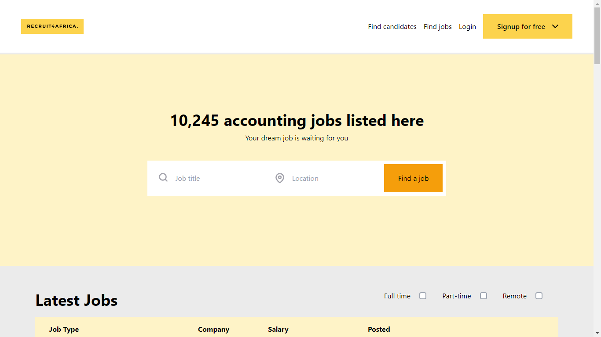

## Introduction

[Recruit4Africa](https://recruit-it.netlify.app/) is a recruiment agency web application. (This is a Work In Progress 🚀🚀). I hope this becomes an inspiration to you; feel free to use components of this codebase in your future projects. I built this to make myself happy, I hope you're happy looking at this project right now and you're making other people happy. ❤️

### Features

- Candidate sign up
- Recruitor sign up
- User account management
- Job Application Management system

## Tools

- [Reactjs](https://reactjs.org) - v16 above
- [Tailwindcss](https://tailwindcss.com) - v2.2 and above

### TO DO

[] Integrate the backend (Postgres, OAuth)
[] Write tests for all the components
[] Move to private hosting.
